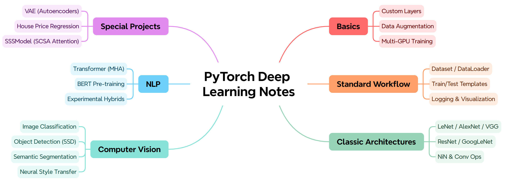

# Pytorch Deep learning Notes
# ----PyTorch 深度学习学习笔记（新手可轻松复现版）
[](https://github.com/Jackksonns) [](https://github.com/Jackksonns/pytorch-deep-learning-notes/stargazers) [](https://github.com/Jackksonns/pytorch-deep-learning-notes/network/members)

------
<div align="center">
  
</div>
<br>

## 项目概述

本仓库汇集了较为系统的 PyTorch 深度学习学习笔记与实现，包含较为完整的从基础神经网络到进阶架构与实战任务。代码参考并改进自李沐（Li Mu）的课程与小土堆的 PyTorch 教程，力求实现既简洁清晰又能直接运行的示例，便于学习与复现。

具体而言，内容涵盖深度学习基础、计算机视觉（CV）、自然语言处理（NLP）以及各类经典与前沿模型的实现。

------

## 详细内容模块

### 1. 深度学习基础 (Deep Learning Basics)
- **`deep_learning_basic/`**: 包含深度学习模型构建的基础积木。
    - 自定义层 (`custom_layer.py`)
    - 数据增广 (`image_augmentation.py`)
    - 参数管理与读写
    - 多 GPU 训练代码示例
- **`pytorch完整流程手搓basis/`**: 一个标准的 PyTorch 项目模版，包含从 `Dataset` 定义、`DataLoader` 加载、模型构建、损失函数、优化器到 TensorBoard 可视化的完整链路。

### 2. 经典卷积神经网络 (Classic CNN Architectures)
位于 **`经典网络架构/`** 目录下：
- **LeNet-5**: CNN 的鼻祖，用于手写数字识别。
- **AlexNet**: 深度学习复兴的里程碑。
- **VGG**: 使用重复元素的深层网络。
- **NiN (Network in Network)**: 引入 1x1 卷积和全局平均池化。
- **GoogLeNet**: 含并行连结的网络 (Inception Block)。
- **ResNet**: 残差网络，解决了深层网络的梯度消失问题。

### 3. 计算机视觉实战 (Computer Vision)
- **图像分类**:
    - `图像分类CIFAR-10`: 基础的 CIFAR-10 数据集分类任务。
    - `树叶分类Classify_leaves`: Kaggle 竞赛实战，包含 ResNet18 和 ResNet50 的迁移学习应用。
    - `狗品种识别ImageNet_Dogs`: 使用预训练模型进行细粒度分类。
- **目标检测**:
    - `SSD`: 手写 SSD 模型，包含多尺度目标检测的实现。
    - `Bounding_Box` & `目标检测数据集及代码`: 介绍了锚框 (Anchor Boxes)、IoU 计算等检测任务的基础。
- **语义分割**:
    - `FCN`: 全卷积网络，使用转置卷积进行上采样。
- **其他**:
    - `风格迁移`: 将一张图像的风格迁移到另一张图像上。
    - `fine_tuning`: 使用 ResNet18 对热狗数据集进行微调。

### 4. 自然语言处理 (NLP)
- **`transformer/`**: 实现了 Transformer 的核心组件，包括多头注意力机制 (MHA) 和位置编码。
- **`bert/`**: 
    - `bert_pretrain.py`: BERT 预训练流程。
    - `bert_finetuning/`: 在 SNLI 数据集上微调 BERT。
- **`explore1/`**: 一个探索性的架构，尝试结合 Inception 模块与 Transformer Encoder/Decoder。

### 5. 其他模型与实验
- **[SSSModel/](https://github.com/Jackksonns/SSSModel)**: 包含自定义的注意力模块 `SCSA` (Spatial Channel Self-Attention) 和相关训练代码。
- **`自编码器/`**: 实现了变分自编码器 (VAE) 并应用于 MNIST 数据集生成。
- **`房价预测House_price_predict/`**: 经典的回归入门任务，提供了单层线性网络和多层感知机 (MLP) 两种实现方案。

------

## Quick Start

### 环境准备

建议使用 Conda 创建一个新的虚拟环境：

```bash
conda create -n dlnote python=3.8
conda activate dlnote
```

然后安装项目依赖：

```bash
pip install -r requirements.txt
```

### 运行示例

1. **基础训练演示**：
   ```bash
   cd pytorch完整流程手搓basis/
   python train.py
   ```

2. **经典网络 (例如 LeNet)**：
   ```bash
   cd 经典网络架构/LeNet/
   python LeNet.py
   ```

3. **BERT 微调**：
   ```bash
   cd bert/bert_finetuning/
   python bert_finetuning.py
   ```

# 学习总结

经过系统学习与大量练习，我把从基础概念、经典网络到实战任务的理解和实现整理成了这个仓库。写这些笔记的初衷是让自己把知识吃透，能上手改改代码，并把能直接运行、容易复现的代码分享给更多像我一样的学习者。

如果你正在学习深度学习或准备做项目or竞赛，这个仓库可以作为一个动手实践的起点：

- 每个模块尽量提供可运行的示例和详尽注释，便于快速上手；
- 代码风格保持模块化，方便拿来微调或二次开发；
- 我也欢迎大家提出 issues、PR 或直接在 Discussions 里交流问题与改进建议。

希望你能拿走你需要的代码、跑通示例、并把你的经验回馈到仓库中，让它变得更好，也让更多人能更容易地上手深度学习。欢迎大家一起用、一起改、一起交流一起进步呀！

## To-do List

-  增加更多前沿架构（如 Swin Transformer）
-  实现更多 NLP 模型
-  补充强化学习示例

## Acknowledgements

感谢以下开源资源与社区对本项目的启发与支持：

- [Li Mu (李沐)](https://github.com/d2l-ai/d2l-zh)老师：优秀的《动手学深度学习》（Dive into Deep Learning）课程与 d2l 包
- [Xiao Tu Dui (小土堆)](https://github.com/xiaotudui/pytorch-tutorial)老师 ：详尽的 PyTorch 教程资源和易上手的代码资源
- 广泛的开源社区：感谢大家共享的资料与工具（本项目也包含一些在kaggle比赛中表现优异的代码实现，具体引用详见对应文件，感谢大家的开源支持）

## ⭐ 如果你觉得这个仓库对你有帮助，请点个Star叭！你的支持是我们持续更新与分享的动力。

**Contact me**: [Jackksonns (Jackson KK)](https://github.com/Jackksonns).

